Model Basics
================

``` r
library(tidyverse)
```

    ## ── Attaching packages ─────────────────────────────────────── tidyverse 1.2.1 ──

    ## ✔ ggplot2 3.2.1     ✔ purrr   0.3.3
    ## ✔ tibble  2.1.3     ✔ dplyr   0.8.3
    ## ✔ tidyr   0.8.3     ✔ stringr 1.4.0
    ## ✔ readr   1.3.1     ✔ forcats 0.4.0

    ## ── Conflicts ────────────────────────────────────────── tidyverse_conflicts() ──
    ## ✖ dplyr::filter() masks stats::filter()
    ## ✖ dplyr::lag()    masks stats::lag()

``` r
library(modelr)
```

# Introduction

# A Simple Model

## A Simulated Dataset

``` r
ggplot(sim1, aes(x, y)) + geom_point()
```

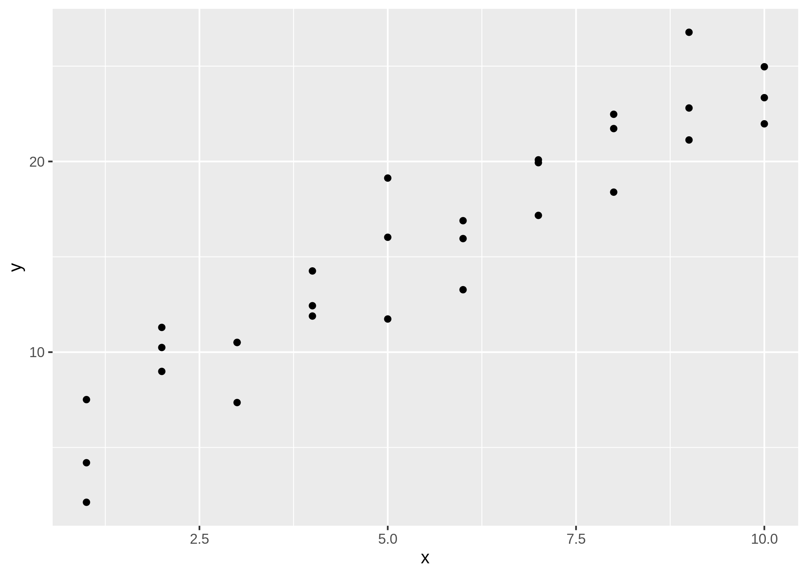<!-- -->

## Many Families to Choose From

``` r
ggplot(mtcars, aes(x = disp, y = mpg)) +
  geom_point() + 
  geom_smooth(method = stats::lm, formula = y ~ poly(x, 1), se = FALSE) +
  labs(title = "y = poly(x, 1)", caption = "Source: mtcars")
```

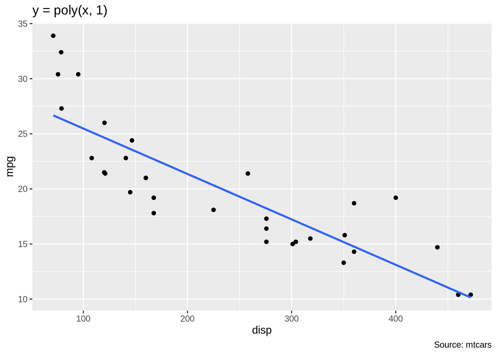<!-- -->

``` r
ggplot(mtcars, aes(x = disp, y = mpg)) +
  geom_point() + 
  geom_smooth(method = stats::lm, formula = y ~ poly(x, 2), se = FALSE) +
  labs(title = "y = poly(x, 2)", caption = "Source: mtcars")
```

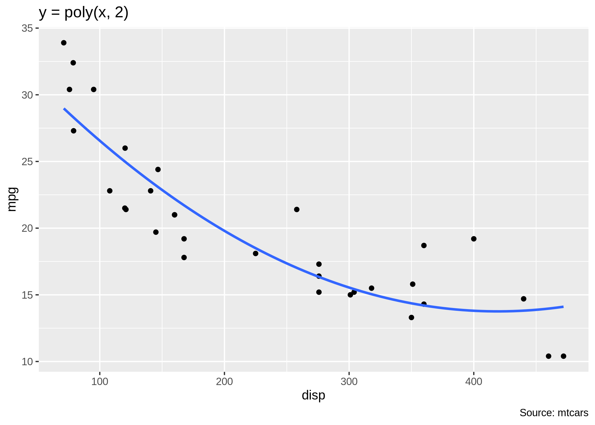<!-- -->

``` r
ggplot(mtcars, aes(x = disp, y = mpg)) +
  geom_point() + 
  geom_smooth(method = stats::lm, formula = y ~ poly(x, 3), se = FALSE) +
  labs(title = "y = poly(x, 3)", caption = "Source: mtcars")
```

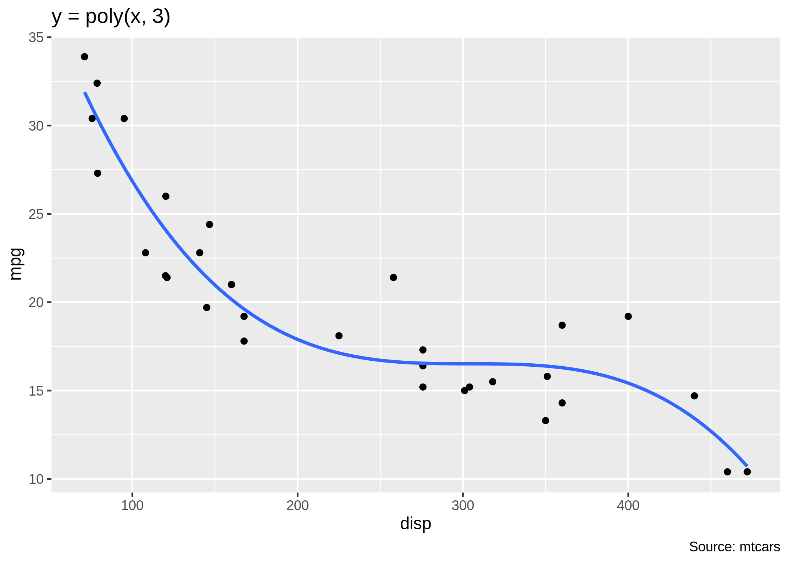<!-- -->

## Many Parameters to Choose From

``` r
models <- tibble(
  a1 = runif(250, -20, 40),
  a2 = runif(250, -5, 5)
)

ggplot(sim1, aes(x, y)) + 
  geom_abline(aes(intercept = a1, slope = a2), data = models, alpha = 1/4) +
  geom_point() +
  labs(caption = "Source: sim1 dataset")
```

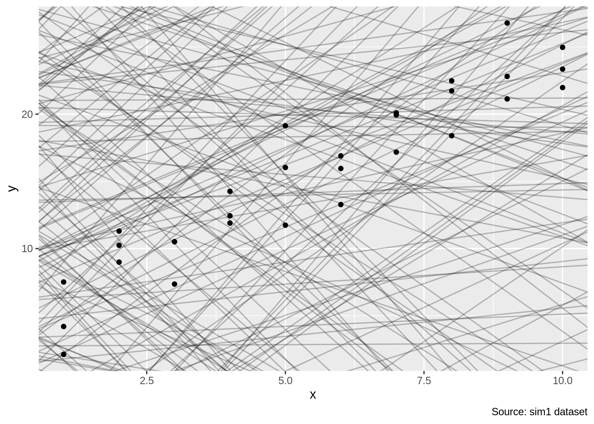<!-- -->

## How do we define a good fit?

One way is to look at the distance from each point to the value
predicted by the model. We want models that provide a small distance for
all points.
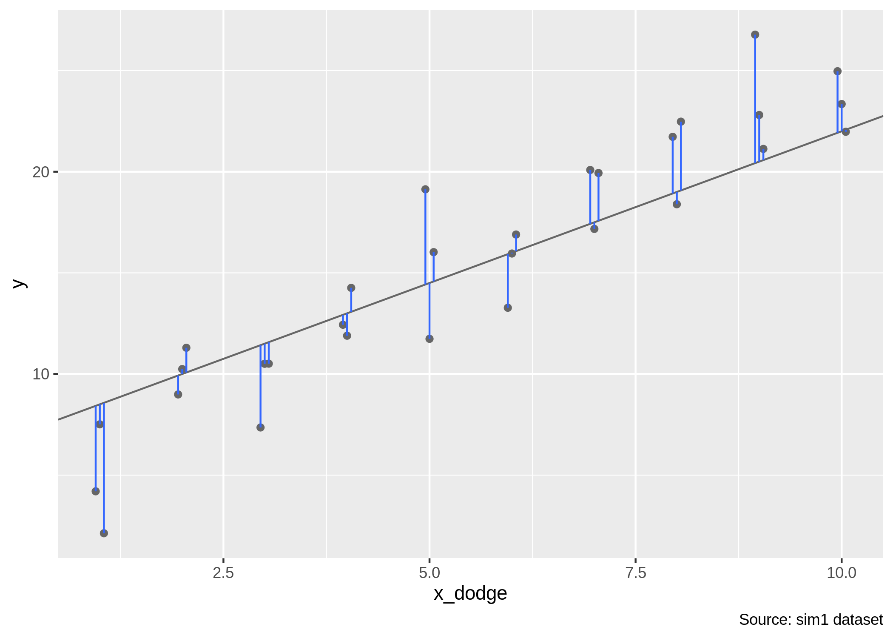<!-- -->

## Compute the Residual

``` r
model1 <- function(a, data) {
  a[1] + data$x * a[2]
}

model1(c(7, 1.5), sim1)
```

    ##  [1]  8.5  8.5  8.5 10.0 10.0 10.0 11.5 11.5 11.5 13.0 13.0 13.0 14.5 14.5
    ## [15] 14.5 16.0 16.0 16.0 17.5 17.5 17.5 19.0 19.0 19.0 20.5 20.5 20.5 22.0
    ## [29] 22.0 22.0

``` r
measure_distance <- function(mod, data) {
  diff <- data$y - model1(mod, data)
  sqrt(mean(diff ^ 2))
}

measure_distance(c(7, 1.5), sim1)
```

    ## [1] 2.665212

``` r
sim1_dist <- function(a1, a2) {
  measure_distance(c(a1, a2), sim1)
}

models <- models %>% 
  mutate(dist = map2_dbl(a1, a2, sim1_dist))

models
```

    ## # A tibble: 250 x 3
    ##        a1     a2  dist
    ##     <dbl>  <dbl> <dbl>
    ##  1  30.6   1.01  21.0 
    ##  2  21.7   2.39  19.4 
    ##  3  -6.22  2.87   6.75
    ##  4   3.15  3.73   9.70
    ##  5  33.4   0.734 22.4 
    ##  6  10.5   1.68   4.92
    ##  7   6.55  1.72   2.39
    ##  8 -19.0  -2.00  47.0 
    ##  9  37.5  -0.859 19.3 
    ## 10  10.7   3.64  16.0 
    ## # … with 240 more rows

## Top 10 Models By Distance

``` r
ggplot(sim1, aes(x, y)) + 
  geom_point(size = 2, colour = "grey30") + 
  geom_abline(
    aes(intercept = a1, slope = a2, colour = -dist), 
    data = filter(models, rank(dist) <= 10)
  ) +
  scale_color_viridis_c() +
  labs(title = "Top 10 Models by Distance", caption = "Source: sim1 dataset")
```

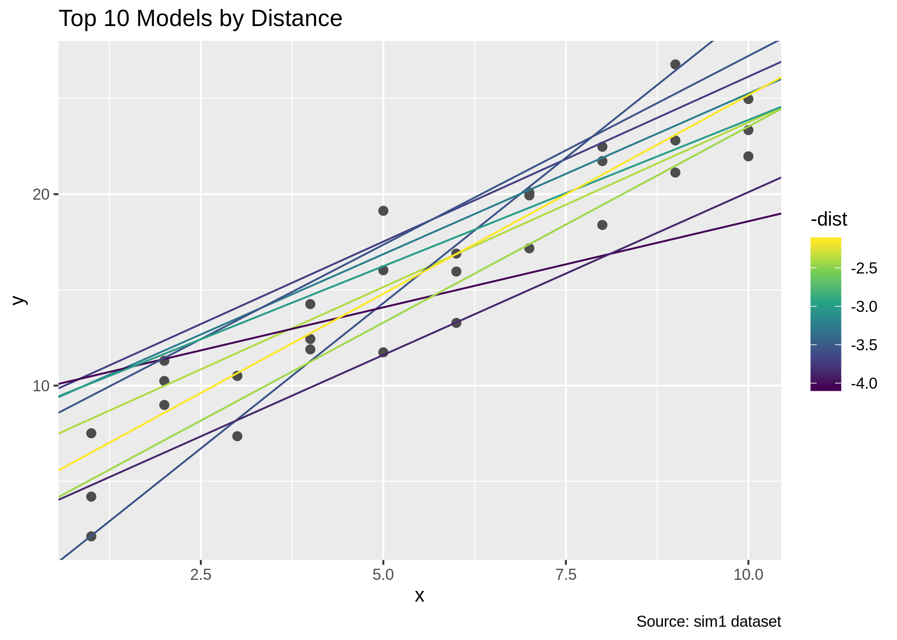<!-- -->

## Plot of Distance by Params

``` r
ggplot(models, aes(a1, a2)) +
  geom_point(data = filter(models, rank(dist) <= 10), size = 4, colour = "red") +
  geom_point(aes(colour = -dist)) +
  scale_color_viridis_c() +
  labs(title = "Model Distance by Parameters", caption = "Source: sim1 dataset")
```

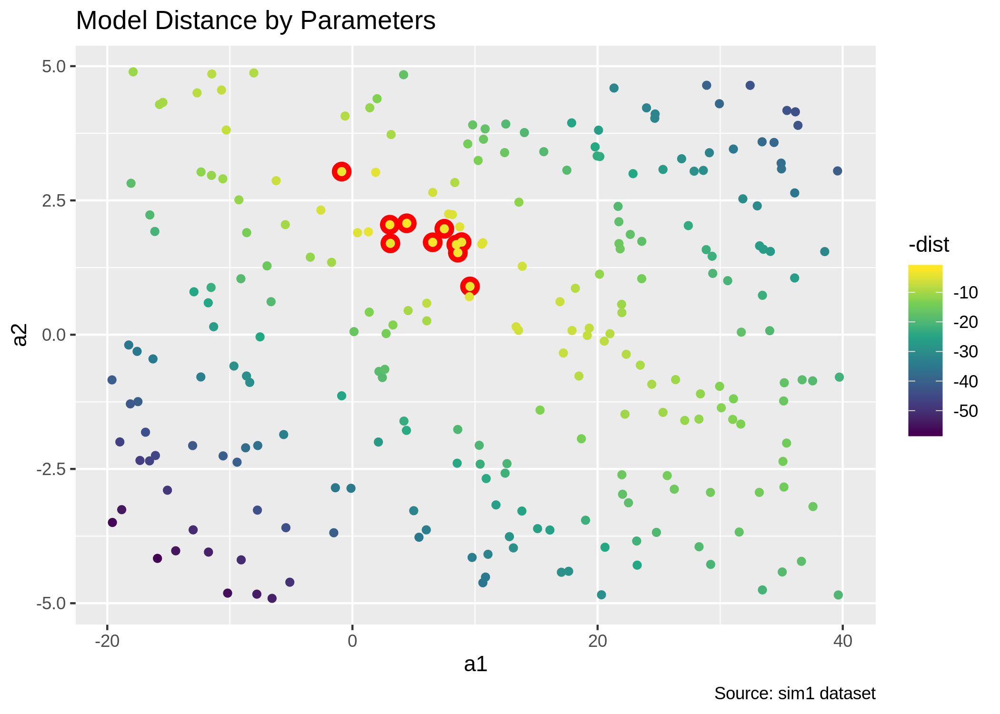<!-- -->

## Grid Search of Parameters

``` r
grid <- expand.grid(
  a1 = seq(-5, 20, length = 25),
  a2 = seq(1, 3, length = 25)
) %>% 
  mutate(dist = map2_dbl(a1, a2, sim1_dist))

grid %>% 
  ggplot(aes(a1, a2)) +
  geom_point(data = filter(grid, rank(dist) <= 10), size = 4, colour = "red") +
  geom_point(aes(colour = -dist)) +
  scale_color_viridis_c() +
  labs(title = "Model Distance by Parameters", caption = "Source: sim1 dataset")
```

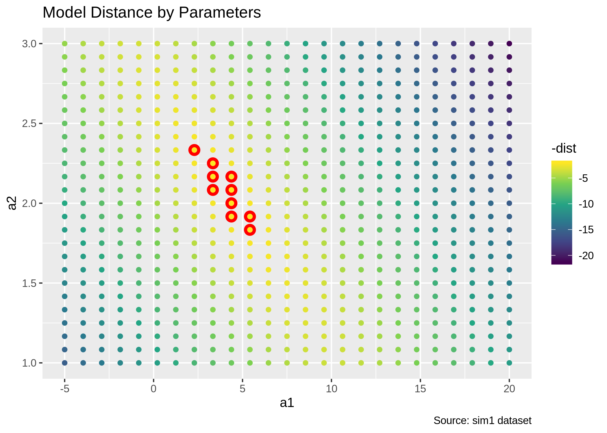<!-- -->

## Top 10 Models from Grid Search

``` r
ggplot(sim1, aes(x, y)) + 
  geom_point(size = 2, colour = "grey30") + 
  geom_abline(
    aes(intercept = a1, slope = a2, colour = -dist), 
    data = filter(grid, rank(dist) <= 10)
  ) +
  scale_color_viridis_c() +
  labs(title = "Top 10 Models by Distance from Grid Search", caption = "Source: sim1 dataset")
```

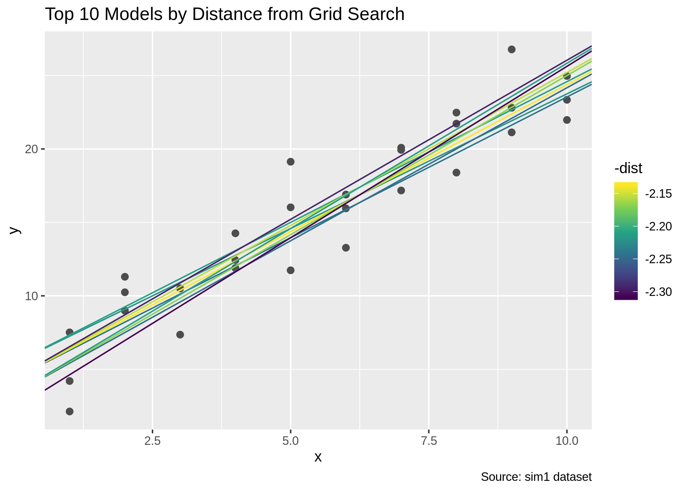<!-- -->

## Grid Search Not Needed

1.  Pick a starting point and look around for the steepest slope.
2.  Then ski down that slope a little way
3.  Repeat again and again, until you can’t go any lower.

In R, we can do that with `optim()` ::: notes
<https://stats.stackexchange.com/a/253636>

Gradient descent maximizes a function using knowledge of its derivative.
Newton’s method, a root finding algorithm, maximizes a function using
knowledge of its second derivative. That can be faster when the second
derivative is known and easy to compute (the Newton-Raphson algorithm is
used in logistic regression). However, the analytic expression for the
second derivative is often complicated or intractable, requiring a lot
of computation. Numerical methods for computing the second derivative
also require a lot of computation – if N values are required to compute
the first derivative, N^2 are required for the second derivative. :::

## Optim Results

``` r
best <- optim(c(0, 0), measure_distance, data = sim1)
#print(best$par)

ggplot(sim1, aes(x, y)) + 
  geom_point(size = 2, colour = "grey30") + 
  geom_abline(intercept = best$par[1], slope = best$par[2]) +
  labs(
    title = sprintf("Best Model: a1 = %s, a2 = %s", 
                    round(best$par[1],2), 
                    round(best$par[2], 2)),
    subtitle = "optim(c(0, 0), measure_distance, data = sim1)",
    caption = "Source: sim1 dataset")
```

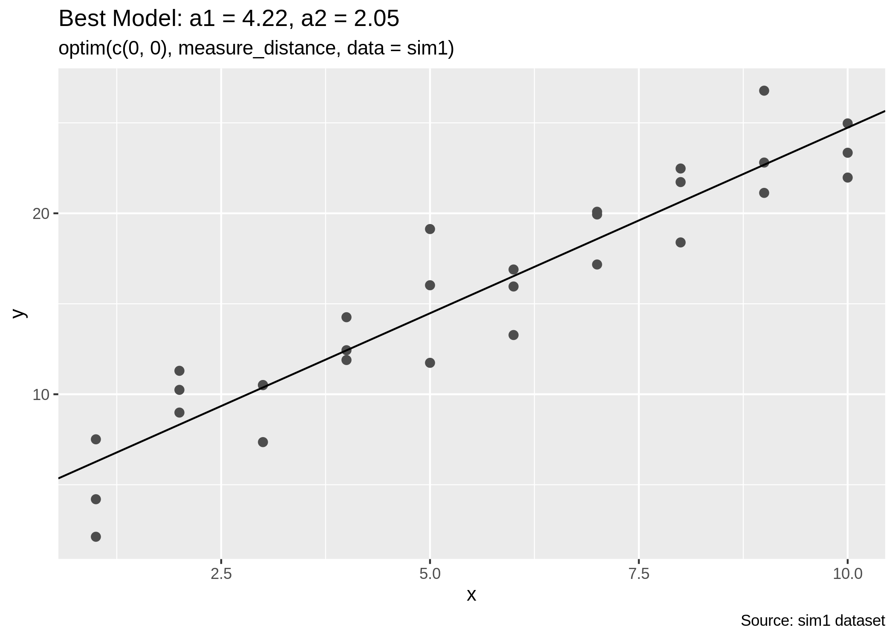<!-- -->

## Use lm() when you can

R has a tool specifically designed for fitting linear models called
`lm()`. `lm()` has a special way to specify the model family: formulas.
Formulas look like `y ~ x`, which `lm()` will translate to a function
like `y = a_1 + a_2 * x`

``` r
sim1_mod <- lm(y ~ x, data = sim1)
coef(sim1_mod)
```

    ## (Intercept)           x 
    ##    4.220822    2.051533

# Visualizing Models

## What do I visualize?

You simple models you can study the coefficients to understand what
patterns the model is capturing. But for more complicated models it is
often more fruitful to study the predictions and residuals.

## Visualizing Predictions

1.  Generate an evenly spaced grid of parameters with
    `modelr::data_grid()`.

<!-- end list -->

``` r
grid <- sim1 %>% data_grid(x)
grid %>% knitr::kable()
```

|  x |
| -: |
|  1 |
|  2 |
|  3 |
|  4 |
|  5 |
|  6 |
|  7 |
|  8 |
|  9 |
| 10 |

## Visualizing Predictions

1.  Generate an evenly spaced grid of parameters with
    `modelr::data_grid()`.
2.  Add predictions with `modelr::add_predictions()`.

<!-- end list -->

``` r
grid <- sim1 %>% 
  data_grid(x) %>% 
  add_predictions(sim1_mod)

grid %>% knitr::kable()
```

|  x |      pred |
| -: | --------: |
|  1 |  6.272355 |
|  2 |  8.323888 |
|  3 | 10.375421 |
|  4 | 12.426954 |
|  5 | 14.478487 |
|  6 | 16.530020 |
|  7 | 18.581553 |
|  8 | 20.633087 |
|  9 | 22.684620 |
| 10 | 24.736153 |

## Visualizing Predictions

1.  Generate an evenly spaced grid of parameters with
    `modelr::data_grid()`.
2.  Add predictions with `modelr::add_predictions()`.
3.  Plot the predictions with ggplot2

<!-- end list -->

``` r
grid <- sim1 %>% 
  data_grid(x) %>% 
  add_predictions(sim1_mod)

ggplot(sim1, aes(x = x)) +
  geom_point(aes(y = y)) +
  geom_line(aes(y = pred), data = grid, color = "red", size = 1) +
  labs(title = "Predictions of Linear Model",
       caption = "Source: sim1 dataset")
```

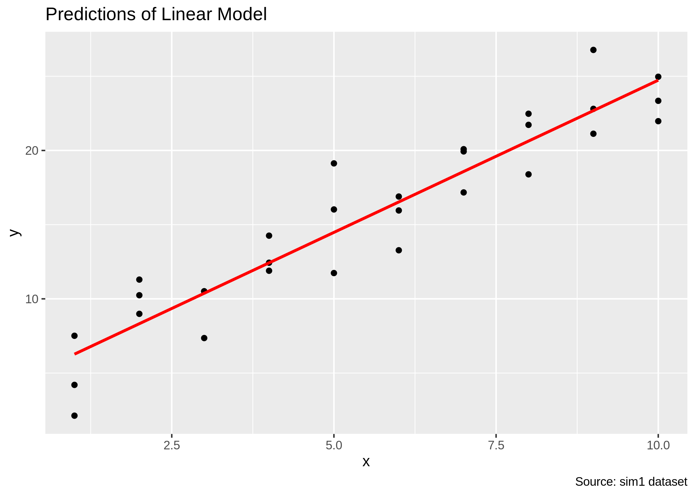<!-- -->

## Visualizing Residuals

The flip-side of predictions are *residuals*. Predictions tell you the
pattern that the model has captured, and the residuals tell you what the
model has missed.

1.  Add predictions and residuals to original dataset

<!-- end list -->

``` r
sim1 <- sim1 %>% add_predictions(sim1_mod) %>% add_residuals(sim1_mod)
knitr::kable(sim1)
```

|  x |         y |      pred |       resid |
| -: | --------: | --------: | ----------: |
|  1 |  4.199913 |  6.272355 | \-2.0724420 |
|  1 |  7.510634 |  6.272355 |   1.2382791 |
|  1 |  2.125473 |  6.272355 | \-4.1468822 |
|  2 |  8.988857 |  8.323888 |   0.6649694 |
|  2 | 10.243105 |  8.323888 |   1.9192174 |
|  2 | 11.296823 |  8.323888 |   2.9729351 |
|  3 |  7.356365 | 10.375421 | \-3.0190565 |
|  3 | 10.505349 | 10.375421 |   0.1299283 |
|  3 | 10.511601 | 10.375421 |   0.1361796 |
|  4 | 12.434589 | 12.426954 |   0.0076349 |
|  4 | 11.892601 | 12.426954 | \-0.5343530 |
|  4 | 14.257964 | 12.426954 |   1.8310099 |
|  5 | 19.130050 | 14.478487 |   4.6515625 |
|  5 | 11.738021 | 14.478487 | \-2.7404661 |
|  5 | 16.024854 | 14.478487 |   1.5463666 |
|  6 | 13.273977 | 16.530020 | \-3.2560434 |
|  6 | 15.955975 | 16.530020 | \-0.5740454 |
|  6 | 16.894796 | 16.530020 |   0.3647758 |
|  7 | 20.085993 | 18.581553 |   1.5044392 |
|  7 | 17.171850 | 18.581553 | \-1.4097031 |
|  7 | 19.936309 | 18.581553 |   1.3547554 |
|  8 | 21.725903 | 20.633087 |   1.0928160 |
|  8 | 18.390913 | 20.633087 | \-2.2421736 |
|  8 | 22.475553 | 20.633087 |   1.8424661 |
|  9 | 26.777010 | 22.684620 |   4.0923902 |
|  9 | 22.805110 | 22.684620 |   0.1204902 |
|  9 | 21.128305 | 22.684620 | \-1.5563143 |
| 10 | 24.968099 | 24.736153 |   0.2319467 |
| 10 | 23.346422 | 24.736153 | \-1.3897306 |
| 10 | 21.975201 | 24.736153 | \-2.7609520 |

## Visualizing Residuals

1.  Add predictions and residuals to original dataset
2.  Plot residuals vs predictions. Hopefully it looks like random noise.

<!-- end list -->

``` r
sim1 <- sim1 %>% add_predictions(sim1_mod) %>% add_residuals(sim1_mod)

ggplot(sim1, aes(x = pred, y = resid)) +
  geom_point() +
  geom_hline(yintercept = 0, color = "blue") + 
  labs(title = "Residuals of Linear Model",
       caption = "Source: sim1 dataset")
```

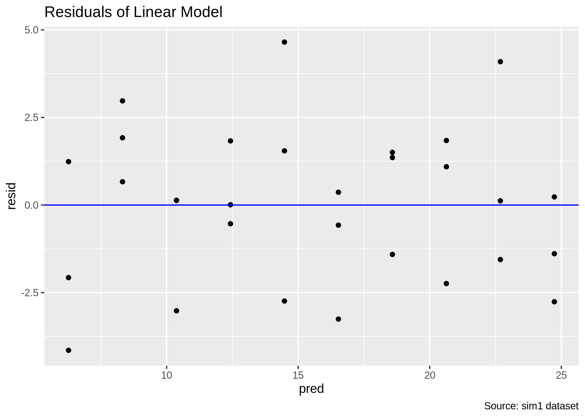<!-- -->

# Formulas and Model Families

## Formulas to Functions

We saw in `lm()` that the formula `y ~ x` gets translated to the
function \(y = a_1 + a_2*x\). Internally R will convert this formula to
a *model matrix*.

``` r
model_matrix(sim1, y ~ x)
```

    ## # A tibble: 30 x 2
    ##    `(Intercept)`     x
    ##            <dbl> <dbl>
    ##  1             1     1
    ##  2             1     1
    ##  3             1     1
    ##  4             1     2
    ##  5             1     2
    ##  6             1     2
    ##  7             1     3
    ##  8             1     3
    ##  9             1     3
    ## 10             1     4
    ## # … with 20 more rows

``` r
model_matrix(sim1, y ~ x + I(x^2))
```

    ## # A tibble: 30 x 3
    ##    `(Intercept)`     x `I(x^2)`
    ##            <dbl> <dbl>    <dbl>
    ##  1             1     1        1
    ##  2             1     1        1
    ##  3             1     1        1
    ##  4             1     2        4
    ##  5             1     2        4
    ##  6             1     2        4
    ##  7             1     3        9
    ##  8             1     3        9
    ##  9             1     3        9
    ## 10             1     4       16
    ## # … with 20 more rows

## Sim2 Dataset

``` r
sim2 %>% sample_n(6) %>% knitr::kable()
```

| x |         y |
| :- | --------: |
| a | 2.6235489 |
| d | 0.3005494 |
| b | 8.5777091 |
| b | 8.0465314 |
| c | 8.6825572 |
| c | 6.5498275 |

``` r
ggplot(sim2) + 
  geom_point(aes(x, y)) +
  labs(caption = "Source: sim2")
```

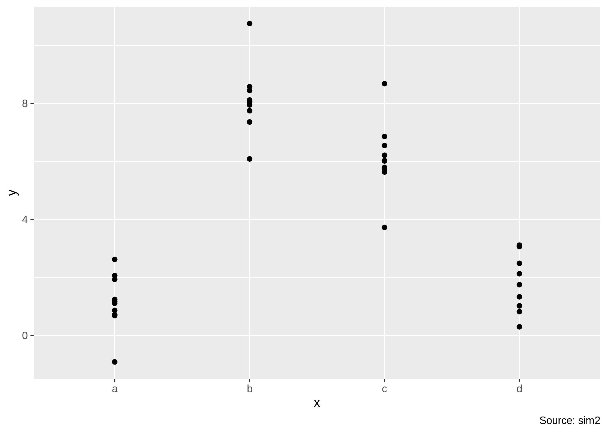<!-- -->

## Formulas with Categorical Variables

If you want to predict a value using categorical variables you can still
use formulas. For example, `y ~ sex` translates to the function
\(y = x_0 + x_1 \cdot \text{sex_male}\)

``` r
model_matrix(sim2 %>% sample_n(10), y ~ x)
```

    ## # A tibble: 10 x 4
    ##    `(Intercept)`    xb    xc    xd
    ##            <dbl> <dbl> <dbl> <dbl>
    ##  1             1     1     0     0
    ##  2             1     0     1     0
    ##  3             1     1     0     0
    ##  4             1     0     0     1
    ##  5             1     0     1     0
    ##  6             1     0     0     0
    ##  7             1     0     0     0
    ##  8             1     1     0     0
    ##  9             1     0     1     0
    ## 10             1     0     1     0

## Sim2 Model

``` r
mod2 <- lm(y ~ x, data = sim2)
grid <- sim2 %>% 
  data_grid(x) %>% 
  add_predictions(mod2)

grid
```

    ## # A tibble: 4 x 2
    ##   x      pred
    ##   <chr> <dbl>
    ## 1 a      1.15
    ## 2 b      8.12
    ## 3 c      6.13
    ## 4 d      1.91

``` r
ggplot(sim2, aes(x = x)) +
  geom_point(aes(y = y)) +
  geom_point(data = grid, aes(y = pred), color = "red", size = 4) +
  labs(title = "Model Prediction Using a Categorical Variable",
       caption = "Source: sim2")
```

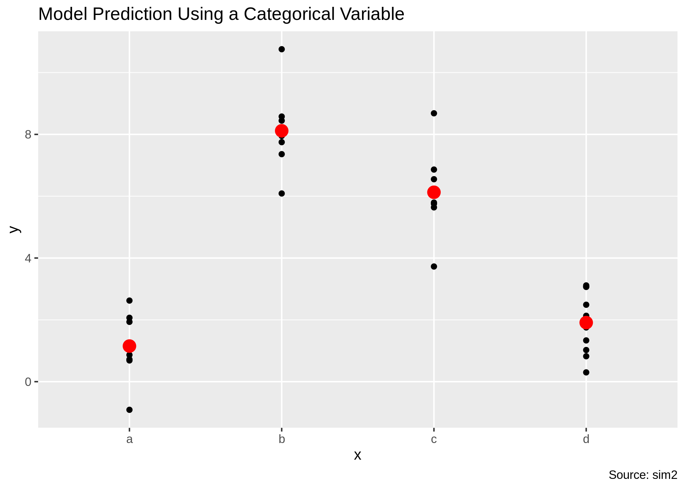<!-- -->

## Sim3 Dataset

``` r
sim3 %>% sample_n(6) %>% knitr::kable()
```

| x1 | x2 | rep |           y | sd |
| -: | :- | --: | ----------: | -: |
|  3 | a  |   2 |   2.3728826 |  2 |
|  5 | a  |   3 |   2.5393693 |  2 |
|  4 | c  |   3 |   6.1685999 |  2 |
| 10 | b  |   1 | \-1.1465239 |  2 |
|  7 | c  |   3 |   5.7291474 |  2 |
|  9 | a  |   2 |   0.4636526 |  2 |

``` r
ggplot(sim3) + 
  geom_point(aes(x1, y, color = x2)) +
  labs(caption = "Source: sim3")
```

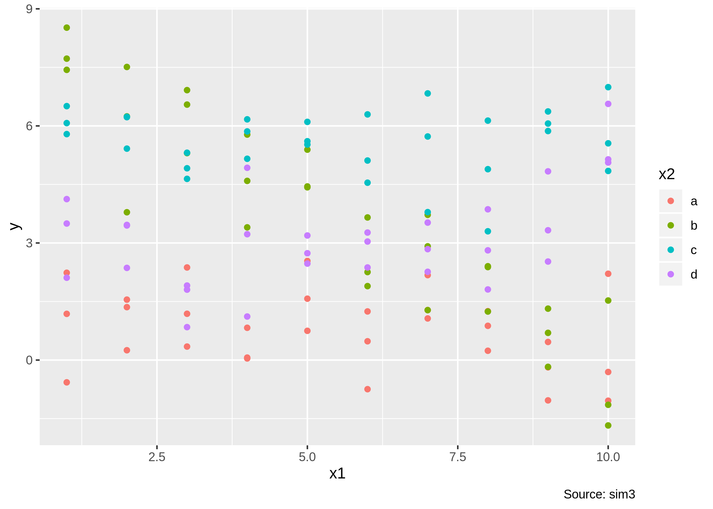<!-- -->

## Questions

What does the model matrix look like for the formula `y ~ x1 + x2`?

``` r
model_matrix(sim3, y ~ x1 + x2)
```

    ## # A tibble: 120 x 5
    ##    `(Intercept)`    x1   x2b   x2c   x2d
    ##            <dbl> <dbl> <dbl> <dbl> <dbl>
    ##  1             1     1     0     0     0
    ##  2             1     1     0     0     0
    ##  3             1     1     0     0     0
    ##  4             1     1     1     0     0
    ##  5             1     1     1     0     0
    ##  6             1     1     1     0     0
    ##  7             1     1     0     1     0
    ##  8             1     1     0     1     0
    ##  9             1     1     0     1     0
    ## 10             1     1     0     0     1
    ## # … with 110 more rows

## The Interaction Term

Iteraction terms can be specified with `*`. Ex. `y ~ x1 * x2`.

``` r
model_matrix(sim3, y ~ x1 * x2)
```

    ## # A tibble: 120 x 8
    ##    `(Intercept)`    x1   x2b   x2c   x2d `x1:x2b` `x1:x2c` `x1:x2d`
    ##            <dbl> <dbl> <dbl> <dbl> <dbl>    <dbl>    <dbl>    <dbl>
    ##  1             1     1     0     0     0        0        0        0
    ##  2             1     1     0     0     0        0        0        0
    ##  3             1     1     0     0     0        0        0        0
    ##  4             1     1     1     0     0        1        0        0
    ##  5             1     1     1     0     0        1        0        0
    ##  6             1     1     1     0     0        1        0        0
    ##  7             1     1     0     1     0        0        1        0
    ##  8             1     1     0     1     0        0        1        0
    ##  9             1     1     0     1     0        0        1        0
    ## 10             1     1     0     0     1        0        0        1
    ## # … with 110 more rows

## Interactions (Continuous and Categorical)

Let’s build a model with indepdendent terms `+` and interaction terms
`*`.

``` r
mod1 <- lm(y ~ x1 + x2, data = sim3)
mod2 <- lm(y ~ x1 * x2, data = sim3)
```

## Visualizing Interaction Models

1.  Build the grid

<!-- end list -->

``` r
grid <- sim3 %>% data_grid(x1, x2)
grid
```

    ## # A tibble: 40 x 2
    ##       x1 x2   
    ##    <int> <fct>
    ##  1     1 a    
    ##  2     1 b    
    ##  3     1 c    
    ##  4     1 d    
    ##  5     2 a    
    ##  6     2 b    
    ##  7     2 c    
    ##  8     2 d    
    ##  9     3 a    
    ## 10     3 b    
    ## # … with 30 more rows

## Visualizing Interaction Models

1.  Build the grid with `data_grid()`
2.  Add predictions with `gather_predictions()`

<!-- end list -->

``` r
grid <- sim3 %>% 
  data_grid(x1, x2) %>% 
  gather_predictions("y ~ x1 + x2" = mod1, "y ~ x1 * x2" = mod2)

grid
```

    ## # A tibble: 80 x 4
    ##    model          x1 x2     pred
    ##    <chr>       <int> <fct> <dbl>
    ##  1 y ~ x1 + x2     1 a      1.67
    ##  2 y ~ x1 + x2     1 b      4.56
    ##  3 y ~ x1 + x2     1 c      6.48
    ##  4 y ~ x1 + x2     1 d      4.03
    ##  5 y ~ x1 + x2     2 a      1.48
    ##  6 y ~ x1 + x2     2 b      4.37
    ##  7 y ~ x1 + x2     2 c      6.28
    ##  8 y ~ x1 + x2     2 d      3.84
    ##  9 y ~ x1 + x2     3 a      1.28
    ## 10 y ~ x1 + x2     3 b      4.17
    ## # … with 70 more rows

## Visualizing Interaction Models

1.  Build the grid with `data_grid()`
2.  Add predictions with `gather_predictions()`
3.  Plot predictions with **ggplot**

<!-- end list -->

``` r
grid <- sim3 %>% 
  data_grid(x1, x2) %>% 
  gather_predictions("y ~ x1 + x2" = mod1, "y ~ x1 * x2" = mod2)

ggplot(sim3, aes(x = x1, y = y, color = x2)) +
  geom_point() +
  geom_line(data = grid, aes(y = pred)) +
  facet_wrap(~model)
```

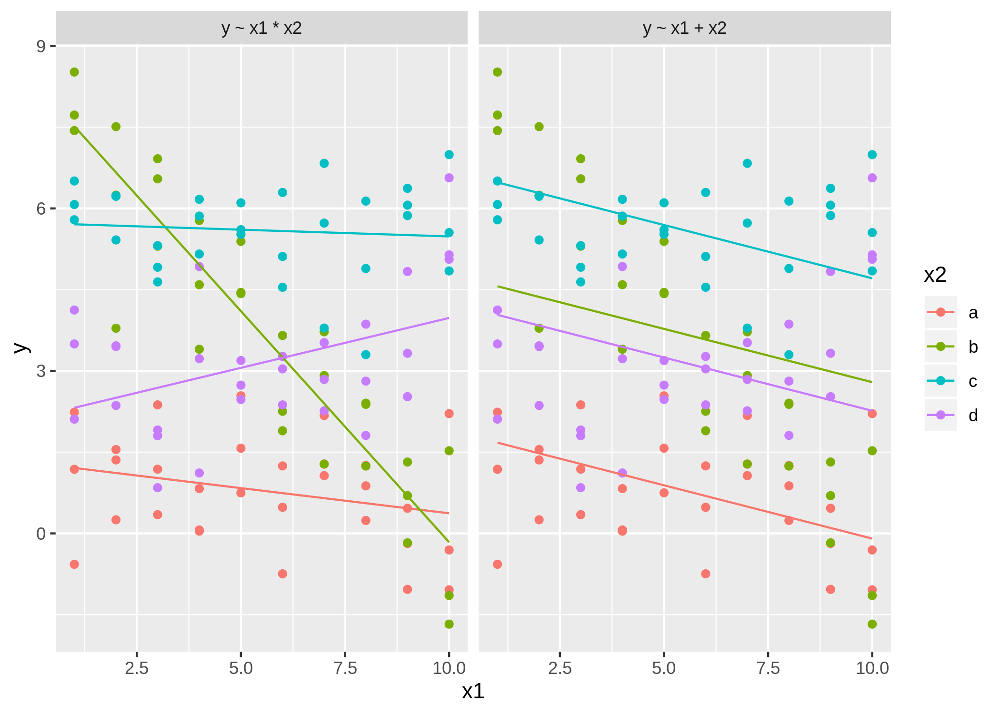<!-- -->

``` r
sim3 <- modelr::sim3 %>% 
  gather_residuals("y ~ x1 + x2" = mod1, "y ~ x1 * x2" = mod2)

ggplot(sim3, aes(x1, resid, color = x2)) + 
  geom_point() + 
  geom_hline(yintercept = 0, linetype = "dashed", color = "gray30") +
  scale_color_discrete(guide = "none") +
  facet_grid(model ~ x2) +
  labs(caption = "Source: sim3")
```

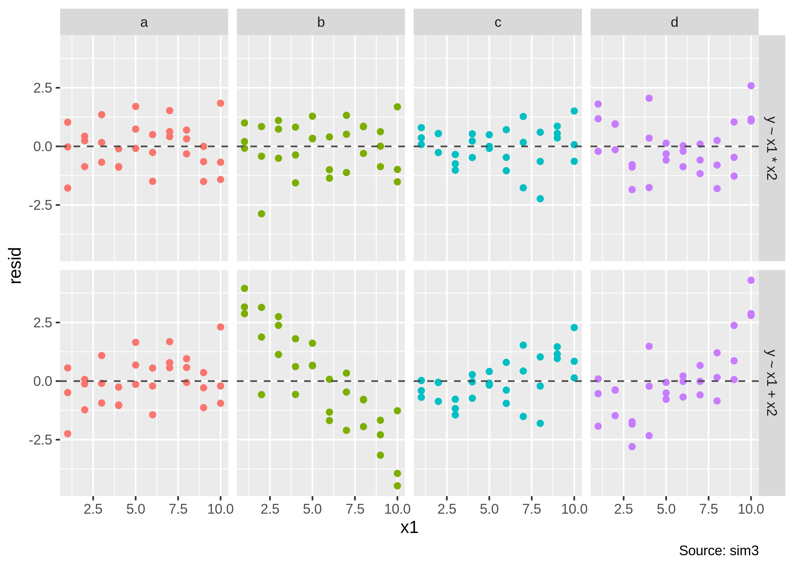<!-- -->

## Sim4 Dataset

``` r
sim4 %>% sample_n(6) %>% knitr::kable()
```

|          x1 |          x2 | rep |           y |
| ----------: | ----------: | --: | ----------: |
|   0.5555556 |   0.3333333 |   1 |   2.0834913 |
|   0.3333333 | \-0.3333333 |   1 |   4.0089203 |
| \-1.0000000 |   0.5555556 |   1 | \-4.9034980 |
|   0.1111111 | \-1.0000000 |   2 |   7.2844882 |
| \-0.1111111 |   0.5555556 |   3 | \-2.2891775 |
|   0.3333333 | \-0.7777778 |   1 |   0.7898947 |

## Sim4 Grid

``` r
mod1 <- lm(y ~ x1 + x2, data = sim4)
mod2 <- lm(y ~ x1 * x2, data = sim4)

grid <- sim4 %>% 
  data_grid(
    x1 = seq_range(x1, 5),
    x2 = seq_range(x2, 5)) %>% 
  gather_predictions(
    "y ~ x1 + x2" = mod1,
    "y ~ x1 * x2" = mod2
  )

grid
```

    ## # A tibble: 50 x 4
    ##    model          x1    x2   pred
    ##    <chr>       <dbl> <dbl>  <dbl>
    ##  1 y ~ x1 + x2  -1    -1    0.996
    ##  2 y ~ x1 + x2  -1    -0.5 -0.395
    ##  3 y ~ x1 + x2  -1     0   -1.79 
    ##  4 y ~ x1 + x2  -1     0.5 -3.18 
    ##  5 y ~ x1 + x2  -1     1   -4.57 
    ##  6 y ~ x1 + x2  -0.5  -1    1.91 
    ##  7 y ~ x1 + x2  -0.5  -0.5  0.516
    ##  8 y ~ x1 + x2  -0.5   0   -0.875
    ##  9 y ~ x1 + x2  -0.5   0.5 -2.27 
    ## 10 y ~ x1 + x2  -0.5   1   -3.66 
    ## # … with 40 more rows

## Interactions (Continuous and Continuous)

The models appear to perform similarily …

``` r
ggplot(grid, aes(x1, x2)) +
  geom_tile(aes(fill = pred)) +
  facet_wrap(~model) +
  scale_fill_viridis_c() +
  labs(caption = "Source: sim4")
```

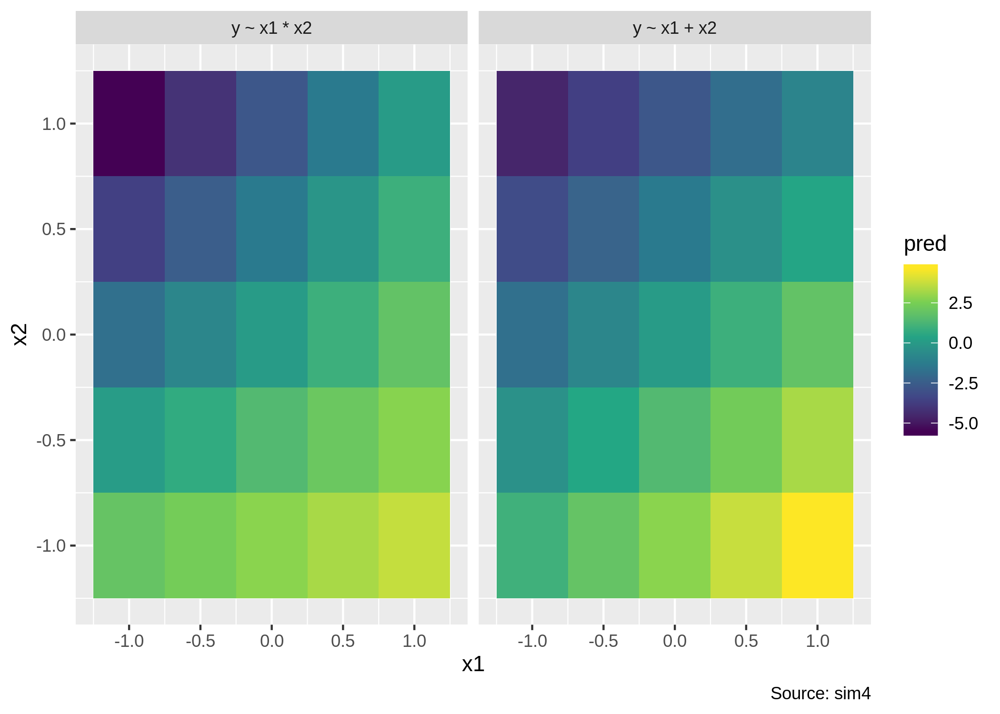<!-- -->

## Interactions (Continuous and Continuous)

… but they do have different behaviour.

``` r
ggplot(grid, aes(x1, pred, color = x2, group = x2)) +
  geom_line() +
  facet_wrap(~ model) +
  labs(caption = "Source: sim4")
```

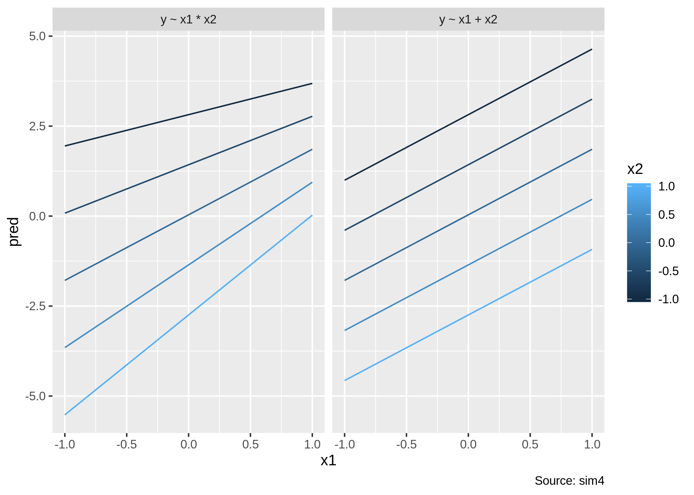<!-- -->

## Transformations

You can perform transformations inside the model formula. For example,
`log(y) ~ sqrt(x1) + x2` is transformed to
\(\text{log}(y) = a_1 + a_2 \cdot \text{sqrt}(x_1) + a_3 \cdot x_2\).

You can also use functions like `poly()` to fit polynomial functions and
`ns()` to fit natural splines.

## Sim5 Dataset

``` r
sim5 <- tibble(
  x = seq(0, 3.5 * pi, length = 50),
  y = 4 * sin(x) + rnorm(length(x))
)

ggplot(sim5, aes(x, y)) +
  geom_point() +
  labs(caption = "Source: sim5")
```

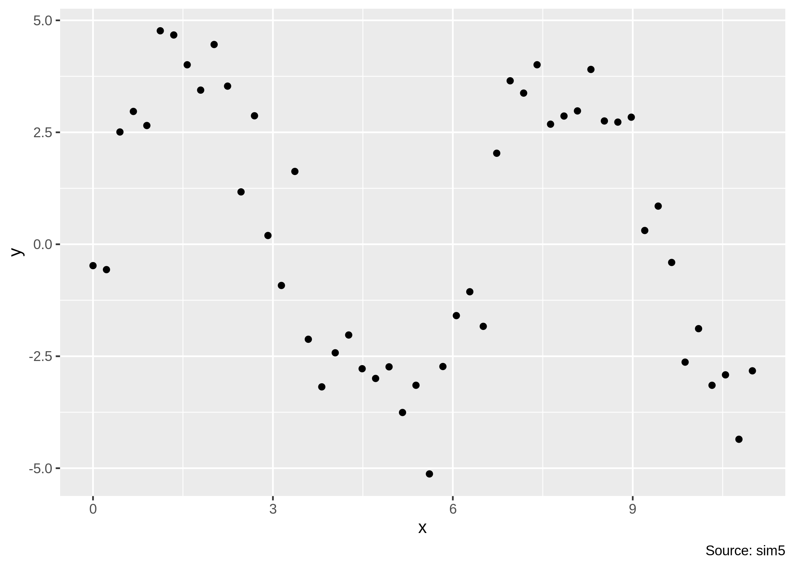<!-- -->

``` r
library(splines)
mod1 <- lm(y ~ ns(x, 1), data = sim5)
mod2 <- lm(y ~ ns(x, 2), data = sim5)
mod3 <- lm(y ~ ns(x, 3), data = sim5)
mod4 <- lm(y ~ ns(x, 4), data = sim5)
mod5 <- lm(y ~ ns(x, 5), data = sim5)
```

## Plots

``` r
grid <- sim5 %>% 
  data_grid(x = seq_range(x, n = 50, expand = 0.1)) %>% 
  gather_predictions(
    "y ~ ns(x,1)" = mod1, 
    "y ~ ns(x,2)" = mod2, 
    "y ~ ns(x,3)" = mod3, 
    "y ~ ns(x,4)" = mod4, 
    "y ~ ns(x,5)" = mod5, 
    .pred = "y")

ggplot(sim5, aes(x, y)) + 
  geom_point() +
  geom_line(data = grid, colour = "red") +
  facet_wrap(~ model) +
  labs(caption = "Source: sim5")
```

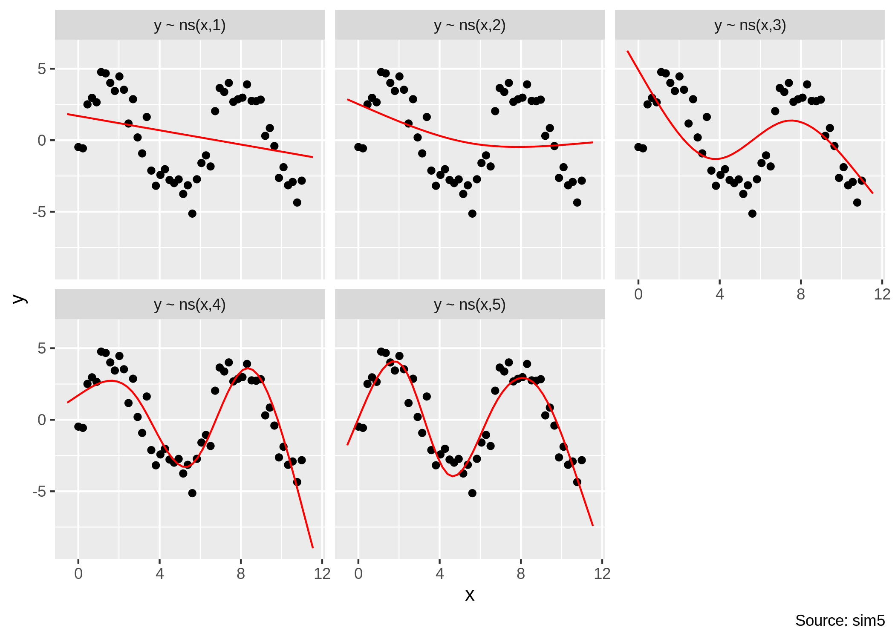<!-- -->

## Popular Modeling Functions in R

| function       | package      | type                        |
| :------------- | :----------- | :-------------------------- |
| lm()           | stats        | linear models               |
| glm()          | stats        | generalized linear models   |
| gam()          | mgcv         | generalized additive models |
| glmnet         | glmnet       | penalized linear models     |
| rlm()          | MASS         | robust linear models        |
| rpart()        | rpart        | trees                       |
| randomForest() | randomForest | random forests              |
| xgboost()      | xgboost      | gradient boosting machines  |

## TidyModels

**tidymodels** is a *meta-package* for modeling and statistical analysis
that share the underlying design philosophy, grammar, and data
structures of the tidyverse.


# Conclusion
